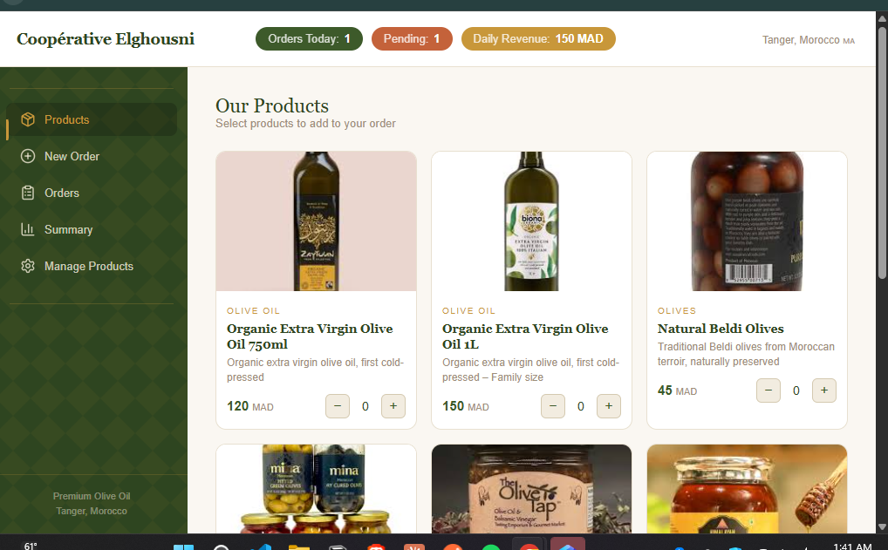
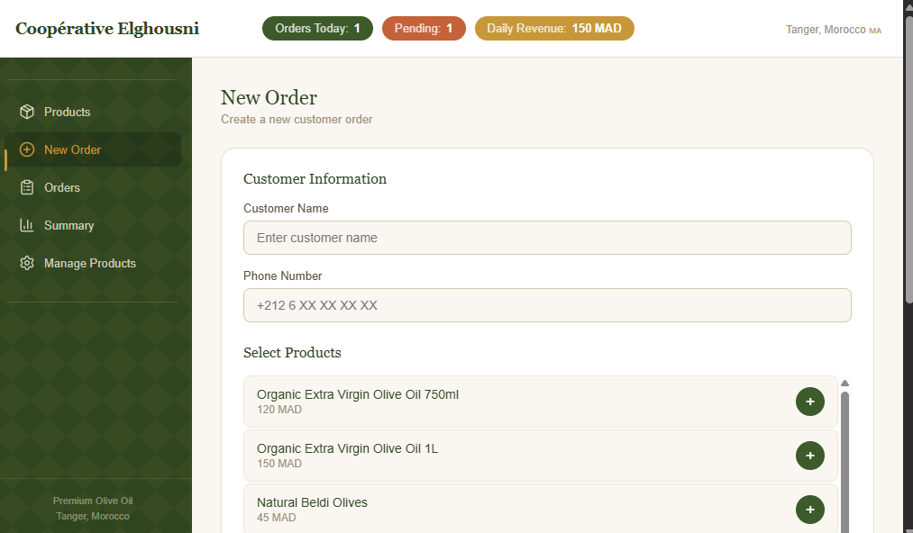
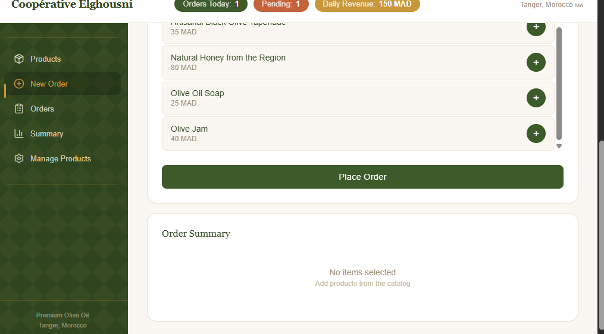
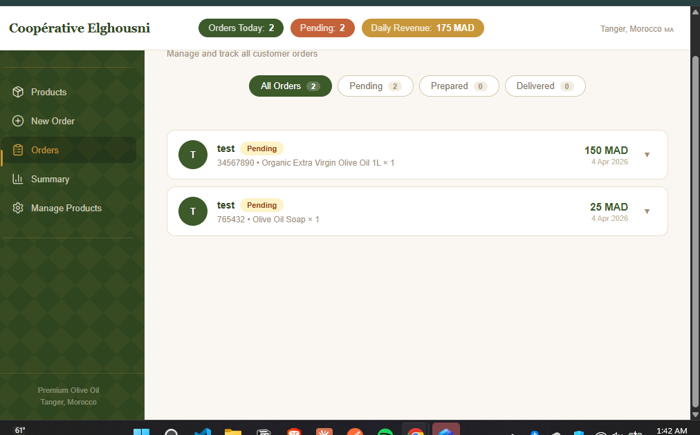
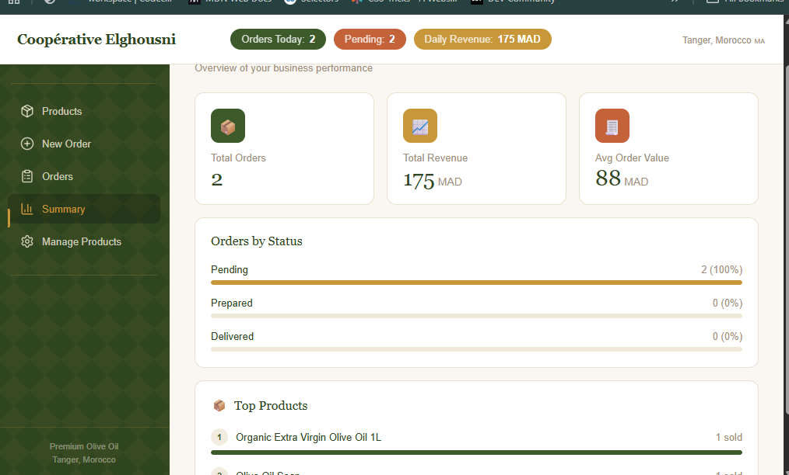
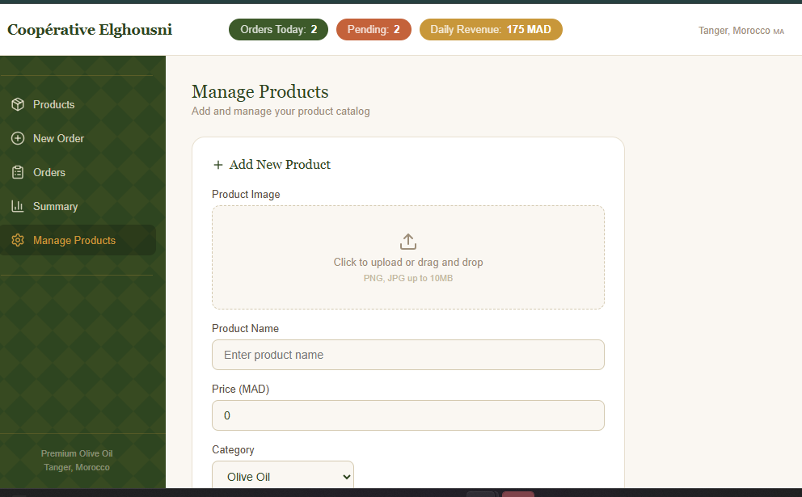
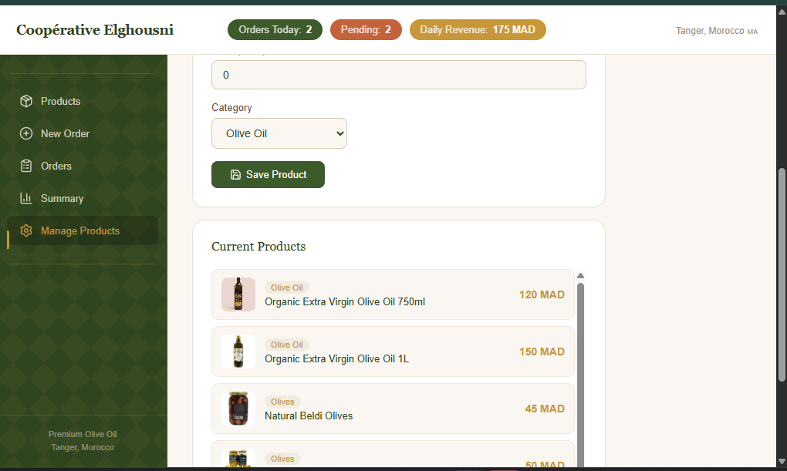

# 🫒 Elghousni Order Management System

A React application built for **Coopérative Elghousni**, a Moroccan agricultural cooperative specializing in olive oil and local products near Tanger. This app digitizes and streamlines their order management process — replacing paper-based tracking with a clean, fast interface.

---

## 📸 Preview

### 🛍️ Products


### 📋 New Order



### 📦 Orders


### 📊 Summary


### ⚙️ Manage Products


---

## 🎯 Features

- 📋 **New Order Form** — capture client name, phone, products and quantities
- 🛍️ **Product Catalog** — 8 products across 4 categories (Olive Oil, Olives, Honey, Derived Products)
- 🧮 **Auto Total Calculation** — subtotals and grand total computed automatically
- 📦 **Order List** — view all orders at a glance with client info and total
- 🔍 **Filter by Status** — filter orders by All / Pending / Prepared / Delivered
- 🏷️ **Status Badges** — color-coded visual indicators per order status
- ✏️ **Update Status** — change order status as it progresses
- 🗑️ **Delete Orders** — remove cancelled or duplicate orders
- 📄 **Order Details** — full breakdown of products, quantities and prices

---

## 🛠️ Tech Stack

| Technology | Usage |
|---|---|
| React 19 | UI Framework |
| React Router v7 | Page navigation |
| Zustand | Global state management |
| CSS3 | Styling |
| Create React App | Project setup |

---

## 🗂️ Project Structure

```
src/
├── components/
│   ├── FilterBar.jsx        # Filter orders by status
│   ├── Navbar.jsx           # Navigation bar
│   ├── OrderCard.jsx        # Individual order card
│   ├── OrderDetails.jsx     # Full order details view
│   ├── OrderForm.jsx        # New order form
│   ├── OrderList.jsx        # List of all orders
│   ├── OrderSummary.jsx     # Order summary with totals
│   ├── ProductDetails.jsx   # Single product details
│   ├── Products.jsx         # Product catalog display
│   ├── ProductSelector.jsx  # Product selection in form
│   ├── Sidebar.jsx          # Sidebar navigation
│   └── StatusBadge.jsx      # Color-coded status badge
├── data/
│   └── products.js          # Product catalog data
├── pages/
│   ├── OrderListPage.jsx    # Orders list page
│   └── OrdersPage.jsx       # Orders management page
├── store/
│   └── useStore.js          # Zustand global store
├── App.jsx
├── App.css
└── index.js
```

---

## 🛍️ Product Catalog

| Product | Category | Price (MAD) |
|---|---|---|
| Organic Extra Virgin Olive Oil 750ml | Olive Oil | 120 |
| Organic Extra Virgin Olive Oil 1L | Olive Oil | 150 |
| Natural Beldi Olives | Olives | 45 |
| Marinated Beldi Olives | Olives | 50 |
| Artisanal Black Olive Tapenade | Processed Products | 35 |
| Natural Honey from the Region | Honey | 80 |
| Olive Oil Soap | Derived Products | 25 |
| Olive Jam | Derived Products | 40 |

---

## 📊 Order Statuses

| Status | Color | Meaning |
|---|---|---|
| 🟡 Pending | Amber | Order received, not yet prepared |
| 🔵 Prepared | Blue | Order is ready for delivery |
| 🟢 Delivered | Green | Order delivered to client |

---

## 🚀 Getting Started

### Prerequisites
- Node.js v18+
- npm

### Installation

```bash
# Clone the repository
git clone https://github.com/wiissal/elghousni-order-management.git

# Navigate into the project
cd elghousni-order-management

# Install dependencies
npm install

# Start the development server
npm start
```

The app will run at [http://localhost:3000](http://localhost:3000)

---

## 🔗 Links

- 🔗 **Live Demo**: _coming soon_
- 🎨 **Figma Design**: _[ Figma link here](https://www.figma.com/design/CQD0p4RAb07FRsSHHu8kfE/Elghousni-order-management?t=OOEs37g9IWBglrp1-1)_
- 📋 **GitHub Projects**: [Project Board](https://github.com/wiissal/elghousni-order-management/projects)

---

## 👩‍💻 Author

**Wissal** — Fullstack Developer  
[LinkedIn](https://linkedin.com/in/wissalouboujemaa) · [GitHub](https://github.com/wiissal)

---

## 📄 License

All rights reserved.
